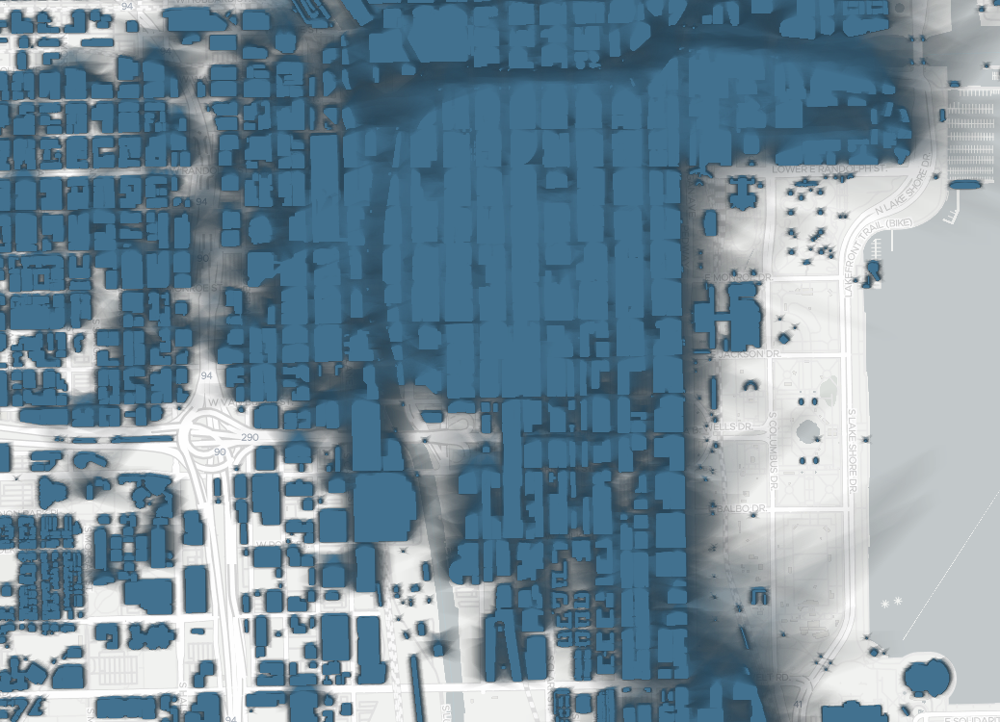

# CS594 - Big Data Visualization & Analytics (Fall 2021)

Instructor: Fabio Miranda

Course webpage: https://fmiranda.me/courses/cs594-fall-2021/

## Assignment 1: D3 and Angular
The goal of this assignment is to get you familiar JavaScript / TypeScript, D3, Angular, development environment, and the assignment submission process. You will develop a web application to visualize the spatial distribution of accumulated shadows per season of the year. You can download the datasets [here](), and find more information [here](https://fmiranda.me/publications/shadow-accrual-maps/) and [here](https://github.com/VIDA-NYU/shadow-accrual-maps/).

There are three tasks, and you are free to use the skeleton code provided. The skeleton code is an Angular project with two components:

```
ng new shadow-maps
ng generate component map
ng generate component chart
```

The code makes use of [D3.js](https://d3js.org/) and [OpenLayers](https://openlayers.org/):

```
npm install --save-dev d3 ol @types/d3 @types/ol
```

### Tasks

#### Task 1
Create an [OpenLayers](https://openlayers.org/) map inside the MapComponent. The map should contain one [TileLayer](https://openlayers.org/en/latest/apidoc/module-ol_layer_Tile-TileLayer.html) (e.g., ``new OSM()``, but you are free to use [tiles accessed through URLs](https://openlayers.org/en/latest/examples/xyz.html)). Make sure to set the view so that it is centered in Chicago (i.e., ``center: transform([-87.6298, 41.8781], 'EPSG:4326', 'EPSG:3857')``). After completing this task, you should see something similar to the image below:


#### Task 2
Download the data shadow from [here]() and unzip it inside the ``src/assets/`` folder. There will be three new folders, each for a season of the year. Inside each season folder, you will find an hierarchy of folders following [slippy map tilenames](https://wiki.openstreetmap.org/wiki/Slippy_map_tilenames) (i.e., filename format is ``/zoom/x/y.png`` for a given zoom level, x and y coordinates). **Notice that there is only one zoom level for each season**. Each pixel of a .png file constains the **normalized** number of minutes a given point is under shadow.

In the MapComponent, create an [ImageLayer](https://openlayers.org/en/latest/apidoc/module-ol_layer_Image-ImageLayer.html) that accesses the data through a [RasterSource](https://openlayers.org/en/latest/apidoc/module-ol_source_Raster-RasterSource.html). A RasterSource is nothing more than a source that transforms input pixel values (e.g., number of minutes under shadow) to output pixel values (e.g., number of minutes under shadow using a colorscale). For example:
```
operation: function(pixels: any, data: any): any {
  let pixel = [0,0,0,0];
  let val = pixels[0][3]/255.0;
  pixel[0]=66*val;
  pixel[1]=113*val;
  pixel[2]=143*val;
  pixel[3]=255*0;
          
  return pixel;
},
```


The normal behavior of OpenLayers (and any tile-based map service) is to access tiles based on the current zoom level; since we only have tiles for **one** zoom level, we must specify to to the RasterSource to **only** access data at that particular zoom level. You can achieve this by creating an [XYZ source](https://openlayers.org/en/latest/examples/xyz.html) with ``tileGrid: createXYZ({tileSize: 256, minZoom: 15, maxZoom: 15})``. After completing this task, you should see something similar to the image below:



#### Task 3
In the ChartComponent, create a simple bar chart using D3 that uses the data read from the shadow tiles and displays the amount of shadow at the location hovered by the mouse. Notice that you will have to establish a communication between two sibling components: MapComponent and ChartComponent. There are [multiple](https://levelup.gitconnected.com/5-ways-to-share-data-between-angular-components-d656a7eb7f96) ways to achieve this. After completing this task, you should see something similar to the animation below:


### Submission
The delivery of the assignment will be done using GitHub Classes. You are free to use any external library for your assignment.

[git](https://en.wikipedia.org/wiki/Git) is a version control system, designed to help developers track different versions of your code, synchronize them across different machines, and collaborate with others. Follow the instructions [here](https://git-scm.com/book/en/v2/Getting-Started-Installing-Git) to install git on your computer. [GitHub](https://github.com/) is a website that supports git as a service. [This](https://guides.github.com/activities/hello-world/) a nice tutorial on how to get started with git and GitHub.

We will provide a GitHub Classroom link for each assignment. Follow the link to create a repository. Use `git clone` to get a local copy of the newly created repository. After writing your code, you can push your modifications to the server using `git commit` followed by `git push`. For example, if your username is `uic-user`:

```
git clone git@github.com:uic-big-data/assignment-1-uic-user.git
git commit -am "submission"
git push
```

### Grading
The code will be evaluated on Firefox. Your submission will be graded according to the quality of the results and interactions.

To get a C on the assignment, your application should display a map of Chicago. To get a B on the assignment, your application should visualize at least one shadow accumulation dataset (i.e., of at least one season). To get an A on the assignment, the application must visualize all shadow datasets, and update the bar chart so that it shows the accumulated shadow at the location hovered by the mouse.